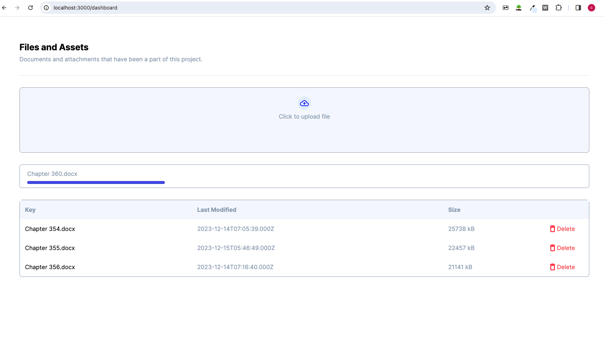

# NextJS app with S3 

## Overview 
This project is a NextJS frontend app that connects to an Express backend to interact with an AWS S3 bucket. 

I wanted to play around a little and learn about NextJS. Clearly, because of the limited functionality of the app, I did not use much features of NextJS and the frontend can easily be accomplished with React. Added dockerfiles but I won't be going onto deploy the application. 

Well anyway, it is a single page dashboard: 



## Prerequisites

- [Node.js](https://nodejs.org/)
- [npm](https://www.npmjs.com/) or [Yarn](https://yarnpkg.com/)

## Setup 

1. Clone the respository: 

```bash 
git clone git@github.com:corliss5156/CS3219-TaskB.git
cd CS3219-TaskB 
```

2. Install dependencies 
```
npm install 
```
3. Configure environmental variables 
Create a `.env` file in the project root and add AWS credentials 
```
AWS_ACCESS_KEY_ID=your_access_key_id
AWS_SECRET_ACCESS_KEY=your_secret_access_key
S3_BUCKET_NAME=your_s3_bucket_name
PORT=8080

```

4. Start the application

```
npm start
```


